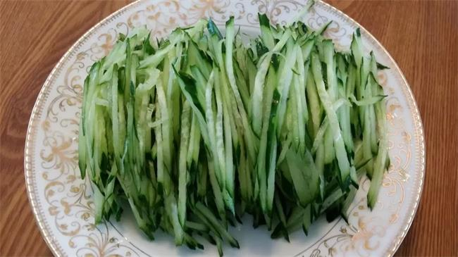
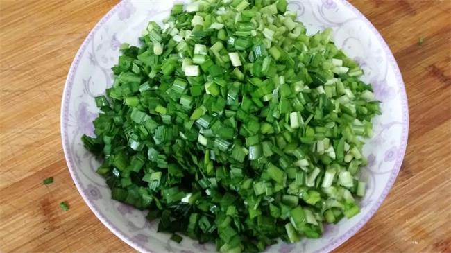
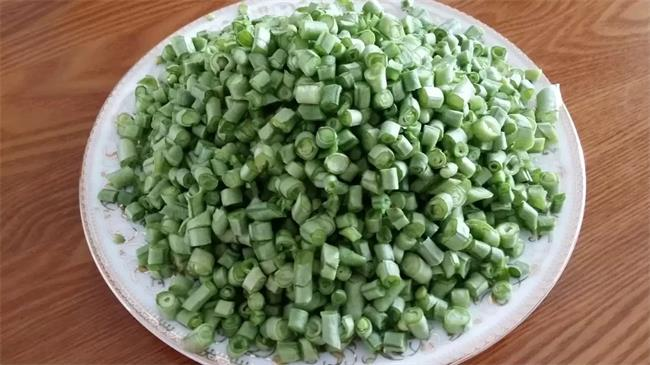

> 基于以下资料汇编而成，感谢他们的无私分享
>
> 1. 新浪博文 -> [临清名吃什香面 · by 义珂姥姥](https://blog.sina.com.cn/s/blog_4d491e510102vosn.html)
> 2. 至味山东纪录片 -> [聊城临清什香面](https://www.bilibili.com/video/BV1V3411b7Yy/)
> 3. 德国的包子寻味临清 -> [什香面](https://www.bilibili.com/video/BV1cz4y1U758/)
> 4. -> [炒豆芽](https://www.bilibili.com/video/BV1A8411F7m9/)
> 5. -> [炒茄丝](https://www.bilibili.com/video/BV1EL4y1n7HC/)
> 6. -> [蒜苔炒肉沫](https://www.bilibili.com/video/BV18K411K7nj/)
> 7. -> [西红柿鸡蛋卤](https://www.bilibili.com/video/BV12o4y1U7GL/)

什香面烹饪制作工艺流程讲究，菜码品种多，名为十样菜，其实，菜料达十八样以上，且随季节变换蔬菜。

## 肉卤

1. 准备：瘦肉末半斤，甜面酱，葱，姜。
2. 做法：
    - 油少许，不用太多，肉里面本来就有充分的油脂；
    - 放八角三粒；
    - 放入肉末炒制，炒制变色后，加黄酒或料酒去腥增香；
    - 放入葱末、姜末、甜面酱（饭勺一勺足够，不必放太多，不然会很咸），继续炒制；
    - 打少量开水（半斤瘦肉，250ml热水上下，不要打凉水，那样肉丁容易发硬）；
    - 中火炖四分钟；
    - 放入少量淀粉水，再炖一分钟，多晃一晃勺，使勾芡均匀；

## 酱菜菜品(临清特产)

- 酱瓜切成末
- 胡萝卜切成末
- 咸疙瘩末
- 韭菜花末

## 调味料

- **芝麻酱**
- **蒜泥**
- 芝麻盐

## 蔬菜菜品

- 黄瓜丝（切丝生吃，味道鲜美）
- 炒茄丝
- 炒韭菜
- 炒绿豆芽
- 炒蒜苔末
- 炒菜豆角末
- 西红柿炒鸡蛋

