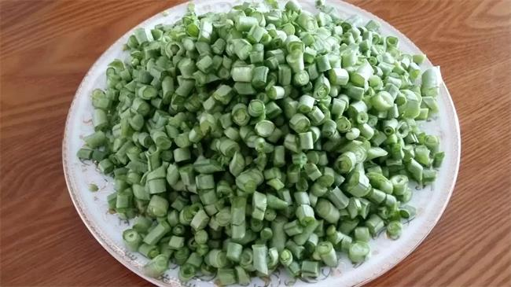
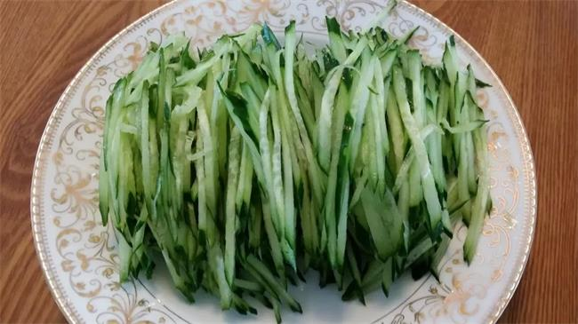
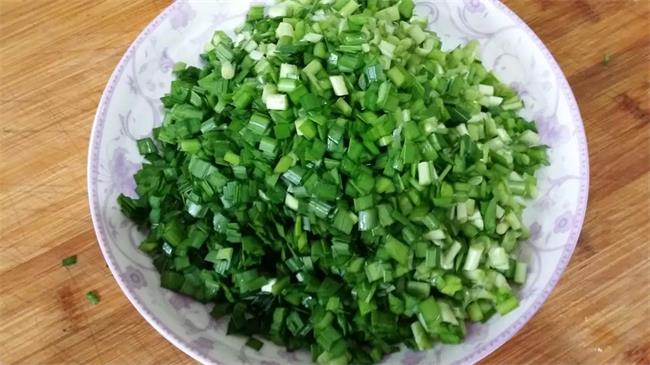
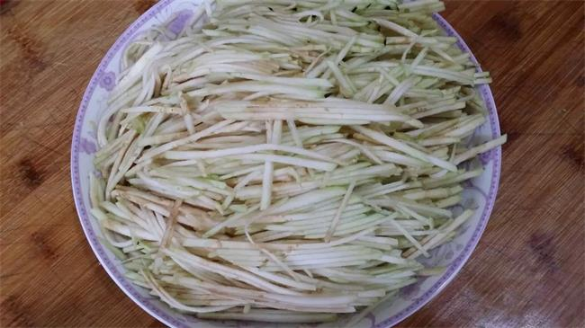

> 基于以下资料汇编而成，感谢他们的无私分享
>
> 1. 新浪博文 [临清名吃什香面 · by 义珂姥姥](https://blog.sina.com.cn/s/blog_4d491e510102vosn.html)
> 2. 至味山东纪录片 [聊城临清什香面](https://www.bilibili.com/video/BV1V3411b7Yy/)
> 3. 德国的包子寻味临清 [什香面](https://www.bilibili.com/video/BV1cz4y1U758/)
> 4. [炒豆芽](https://www.bilibili.com/video/BV1A8411F7m9/)
> 5. [炒茄丝](https://www.bilibili.com/video/BV1EL4y1n7HC/)
> 6. [蒜苔炒肉沫](https://www.bilibili.com/video/BV18K411K7nj/)
> 7. [西红柿鸡蛋卤](https://www.bilibili.com/video/BV12o4y1U7GL/)

什香面烹饪制作工艺流程讲究，菜码品种多，名为十样菜，其实，菜料达十八样以上，且随季节变换蔬菜。

## 蔬菜菜品

- 黄瓜丝
- 炒茄丝
- 炒西胡丝
- 炒绿豆芽
- 炒韭菜
- 炒蒜苔末
- 炒菜豆角末

## 酱菜菜品(临清特产)

- 酱瓜切成末
- 胡萝卜切成末
- 咸疙瘩末
- 韭菜花末

## 调味料

- 香醋
- 芝麻盐
- **芝麻酱**
- **蒜泥**

## 卤

- 西红柿鸡蛋卤
- 肉卤

## 具体做法

韭菜切碎下锅炒熟，茄子切丝下锅炒熟，豆角切碎下锅炒熟，绿豆芽炒熟。

西红柿卤先把鸡蛋炒熟，然后等西红柿炒熟后放在一起搅拌均匀即可。

**肉卤是最讲究火候和加料的，把油烧热后肉末葱丝姜片一起下锅，翻炒至八成熟时加甜面酱和老抽，然后打少量热水，千万不要打凉水，那样肉丁会发硬的，然后中火炖五分钟出锅即可。**

黄瓜是切丝生吃，味道很鲜美。

胡萝卜是我们当地自己腌咸的，切碎后以备口重的客人调味用的。

**麻汁**和**大蒜卤**也是不可缺少的，大蒜砸碎后放上醋搅拌后，味道也很鲜美。
