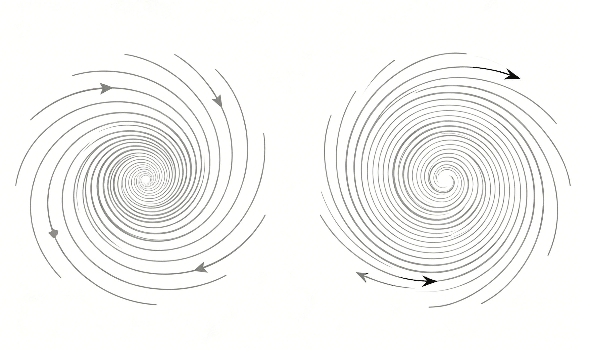

快乐，来源于对头脑恰当运用的过程之中。

<!--more-->

我们都知道算数学题、各门各科的考试费脑子，可是我们却把不快乐、精神郁闷归因于「心理」，我觉得命名不妥。

无论是技术还是艺术，无论是理性还是感性，无论是技战术能力的发挥还是情绪的宣泄，都事关头脑的使用。

于是，人生的最为核心的命题，就有且只有一个了：如何动脑。

我认为：夸人聪明不如夸人有头脑，夸人有头脑不如夸人会思考。

人是一定会动脑的，有的人会往歪门邪道的方向动脑，有的人会往好逸恶劳的方向动脑，有的人会往不动脑的方向动脑，正如英国著名的哲学家 Bertrand Russell 所说：Most people would rather die than think（大多数人宁愿死也不肯思考）。
Russell 给我们指出一个很有意思的视角：虽然人们时时刻刻都在动脑子（大脑在消耗氧气），但是大多数人都不是在动脑子思考，而是“成功”实现了动脑子规避思考。

动脑子规避真正思考的一个显著特征，便是拒绝接触新鲜人、新鲜事儿，拒绝接触、接纳新思想，拒绝主动清扫头脑中已然陈旧的思想。这样的人，往往 ego 很大，所有与自己的观念抵触的东西都被视为冒犯。他们往往是先有结论，后面再去找论据予以证明；他们往往好为人师，以自己有限的经验为正统。

真正的思考是不怕有意见冲突的，甚至，真正的思考者应该主动寻找冲突与矛盾，在观点的激荡中找到真理。

两种思维模式真正的分野在于动脑筋的方向，前者是先确认（往往指向悲观的）结论，再用有限的经验一步步论证确实如此、果然如此，最终陷入预言自证，一步步踏入思维越来越狭小、逼仄的泥坑，难以自拔。后者是不轻易结论，主动探索，主动求证，资料越来越多，对事物的认识越来越丰富和具体，这时，才敢给出一个初步的暂时结论。

前者，思维是受限的；后者，思维是演进的、拓展的。

脑子只有一种用法，叫：动脑子。

动脑子有两种动法：

1. 第一个是无能为力型：自己都觉得自己什么都干不好、永远干不好，因此沮丧，因此长期沮丧，因此悲观，进而需要动脑筋为自己的悲观找理由，看到人类的渺小后最终绝望。
2. 第二个是“进一寸有进一寸的欢喜”型：自己总是干不好，但总是比昨天干得好了，比昨天懂得多了，比昨天少犯错了，比昨天更明白了，进而动脑筋想要更明白些，为什么要征服未知？因为未知就在那里。

这就是头脑运用的真相。
