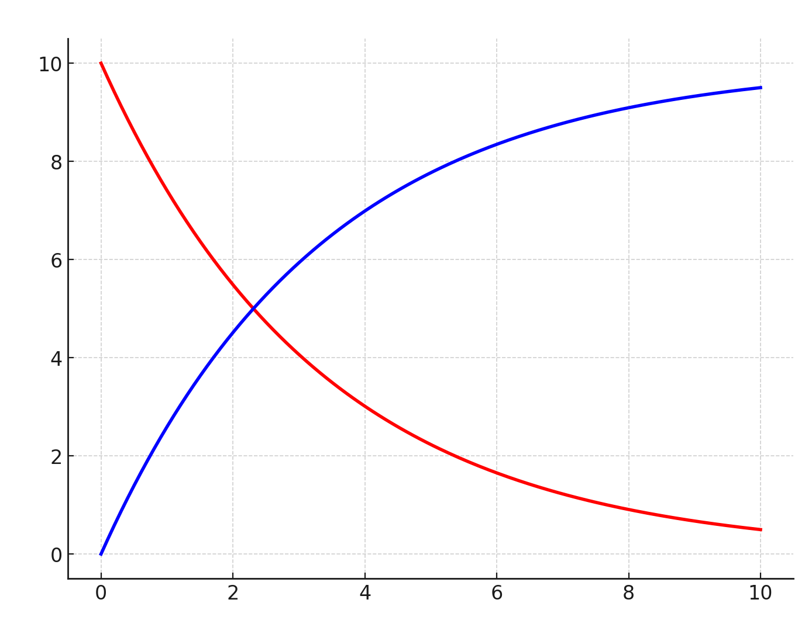

李想先生说成功有三要素：①选得准，②选得长，③跑得快。

这三要素令我沉迷许久，我沿着李想的话题线头深挖下去：①选得准容易理解，选不准就死了，没有成长价值，③跑得快也好理解，你得率先抵达终点，跑得慢的话黄花菜都凉了，只有②选得长，这一点我让我思考许久，我认为也最有研究价值。

<!--more-->

「长」真的仅仅指的是要有长期价值、长期使命么？具备长期价值的事情多了去了，比如修公路，建设物理对撞机，长不长？难不难？难道都要企业家去做？

这个「长」一字，李想先生“藏”得最隐晦，什么是“长”？为什么“长”？“长”的本质是什么？

我觉得李想要表达的“长”一字，实际指的是竞争优势。

长不长不重要，可口可乐卖个糖水有什么长期价值，但依然足够「长」，因为他构建起了足够厚实的竞争优势。

「长」这个字不对，而应该是厚，厚并不是个静态的概念，而是随着时间的累积，逐渐逐渐、一点一点慢慢变厚的，直到别人再也赶不上。

在个体与社会交互的过程中，大体存在两种竞争优势模型：

1. 渐弱模型：这是世界上绝大多数人所采用的生存模型，表现出来的节奏是：一开始的时候，感觉美滋滋，似乎不愁找工作，可越到后来，竞争优势越弱，越困难，越冒汗，越来越难干。
2. 渐强模型：只有一小撮人能找到这个路线。一开始的时候，他不像大多数人那样“聪明的”去抄近路，而是选了一个起点很低、看起来难、费力不讨好的赛道，可是这个赛道有个特点，“没有白走的路，每一步都算数”。

随着时间推移，“渐强模型”的竞争优势越垒越高，而选择“渐弱模型”的人，虽然吃到了开局红利，但是随着竞争对手的低门槛加入，先发优势被挤压殆尽，直到被前一种人追上。自此开始，两种人的境遇便骤然颠倒，前一种人继续扶摇直上，而后一种人则在越来越微弱的竞争优势下艰难求生，又由于前期投入的时间已经锁定，导致根本不可能重头再来，即便再重新开局，与同时期选择“渐强模型”的对手相比，距离已彻彻底底的拉开，于是乎，基本上一辈子都不再可能赶上了。

这就是“渐强模型”的伟大之处：距离一旦拉开，后面的人就再也赶不上（至少很难赶上）。

用最简单的话解释李想的「长」一字：在时间的加持下，使得己方的不可替代性越来越显著。

「长」是时间属性，是现象，而结果更重要，也就是说：时间给你了，你能实现什么样的竞争态势，是越来越弱，还是越来越强？

越来越弱的态势，原因就是一开始做选择的时候偷懒了，导致所选的赛道竞争优势不太好积累，进而导致后面的护城河很难建立，因此，越来越陷入疲于奔命的状态。

越来越强的态势，原因便是一开始做选择的时候用功了，所选赛道具备优势累积的可能，尽管一开始不好走，但你不好走、大家也都不好走，这反倒成为了天然的安全屏障，而很多人就是在这个过程中被刷下去的，你坚持走下去，每一步的投入，都不会白费，竞争优势得以累积，核心价值产生。

修改后的成功三要素是：
1. 选得准
2. 优势厚
3. 跑得快

对不起，李想先生，虽然我很敬重您，但是您说得确实不足够精确，我只能上手去改了。