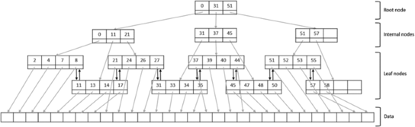

根据维基百科中的[Google](https://zh.wikipedia.org/zh-cn/Google#建立)词条, 曰：Google 这个名字来源于一个数学大数古戈尔（googol，数字1后有100个0）单字错误的拼写方式，象征着为人们提供搜索海量优质信息的决心。

<!--more-->

中国有句谚语，曰：书山有路勤为径，学海无涯苦作舟。

曰：恒河沙数。

曰：汗牛充栋。

## 无脑方案：遍历

文明，人类的文明，是不可数名词，它泛指人类这两万年来取得的所有成果，从刀耕火种到驯化小麦，从部落社会到奴隶社会，从奴隶社会封建社会，从封建社会到资本社会。

如果把文明作为可数名词，把文明量化，把文明原子作为文明的最小颗粒，那么，我们的文明，必然是恒河沙数，必然是汗牛充栋。

如果我们一粒一粒的去数，想遍历文明的话，用宋丹丹的话说：

1. 把文明做快照、镜像
2. 找人找时间
3. 数

逻辑上成立，不是不可能，但好比愚公移山。

我们经常听到「我学不动了」类似的言论，凡有此想法者，都是在用遍历的思想对待文明，对待文明的一部分。

因为想遍历，而数据量无限多也，同时单人时间、单人脑力算力都极其有限也，这注定「学不完」，注定有一天会发出「学不动」的长吁短叹，注定「学海无涯苦作舟」。

## 高性能方案：多叉树

应该换个思路，其中样例，尤其以近现代的「二曼」为至，哪“两曼”呢：

1. 冯·诺依曼
2. 费曼

看似“曼”，其实是快了，其中的原理，书籍《思考快与慢》有详尽的解释。

数据库中有数据几千万条，类似人类文明数据量之庞大，当查询数据的时候，难道要一条一条的遍历吗？MySQL 为了提高查询效率，引入了 B+ 树的概念：

将1到100的所有整数加起来的算术题：
- 对于我们来说，只得闷头去算，因为我们“确信”，闷头去算，是最简单、快捷的方法，绝对正确无误；
- 对于高斯来说，1＋100＝2＋99＝3＋98＝…＝49＋52＝50＋51，1～100正好可以分成这样的50对数，每对数的和都相等，于是，（1+100）×100÷2＝5050，简单、快捷、正确无误。

阿基米德说：给我一个支点，我可以撬动地球。

## 学习之道

我们每个人都坚定的相信着什么，相信自己手边的工具，相信自己的做法绝对正确、没问题。这份“自信”来自于哪里呢？我想大部分人那么做的原因只不过是「大家都那么做」。

- 如果大家都跑，你不知道理由，那么正确的策略是你也跟着大家跑，因为你不跑的话，你很有可能就是被狮子吃掉的那一个，这是“随大流”的基因源头。

- 如果大家都跑，你不跑，你站在前线，你跟狮子鏖战，你通过各种手段打败了狮子，你就是王。

我们身处现代社会，以美加澳、英法中为例，我们面对的问题可能已经不再是生存的问题了，我们面对的问题往往是「如何脱颖而出」的问题了，是「世界那么大，人那么多，我该如何才能冒尖儿」的问题。

冒尖儿、出人头地、鹤立鸡群，是需要强大的心理素质支撑的。大家都跑，你不能跑；大家都在闷头 1+2+3+4... 算，你却停笔，你跟他们说你在观察、思考、洞察，你说你在以退为进，你说深深蹲下为的是高高跳起，老师拿粉笔扔你，同学嘲笑你。你看，不容易做到的。

阿基米德的杠杆定律被人戏称为“物理学圣剑”，人类可以借助杠杆放大力量，将重物轻轻“拾起”。我想，与物质文明相对的逻辑文明，一定也会存在类似的杠杆，可以将浩如烟海的文明一网打尽。

那些通才，那些大家，譬如冯·诺依曼，譬如费曼，肯定是领会了其中的杠杆之妙。

从高处看问题，了解事物最重要的关节、关窍，俯视、自顶向下，有如庖丁解牛；从宏观到微观，居高临下，心里胸有成竹；把书读厚，把书读薄，递推出去，递归回来，归去来兮，游刃有余，一览众山小。

艺术，绝对是他妈的艺术！