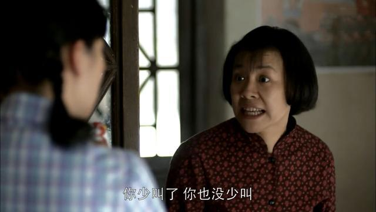

<!--more-->

今晚上家里人一块儿吃席。有个二姐，带着孩子一块儿来的，这个孩子非常难搞。

孩子都七八岁了，家长还在手动往孩子嘴里喂水、喂鸡蛋羹。孩子更绝，鸡蛋羹被填到嘴里后，我不吃，我就不往嘴里送，我就让鸡蛋羹在嘴巴边儿上半空悬着。直到，鸡蛋羹吧嗒落地。二姐尴尬地说：唉，好吧，不吃就不吃吧。

我真替二姐感到深深的忧虑，这个家伙简直是未来家里的一颗雷。

这孩子啊，在席上，又敲筷子又敲碗的，玩儿得那真是个不亦乐乎。后来说想吃米饭，于是大家给他单独又点了一份蛋炒饭。过了一会儿，炒饭还没上来，这个家伙就在那儿叽叽歪歪。再过一会儿，等米饭真上来了，小爷我不想吃了。

嘿！我真想对着这位小少爷怒骂一句：草泥马的，你他妈是谁啊，不想吃滚，别在这儿恶心人。

Lina 问我：你看这孩子像不像是有多动症？

我说：多动只是现象，真正的原因，是没有教养。

我断定，这个孩子将来一定是他家里的 big problem。

孩子啊，娇生惯养起来的，没一个好东西。

你做家长的，看似是为孩子呕心沥血，可实际上呢，在孩子看来，被人周到的伺候着成为理所当然。

少爷病的种子一旦种下，是永远去不了根儿的，那是一种病毒，思想的病毒，让你能健健康康的沦为家庭和社会的吸血鬼、寄生虫。呸，操你妈！