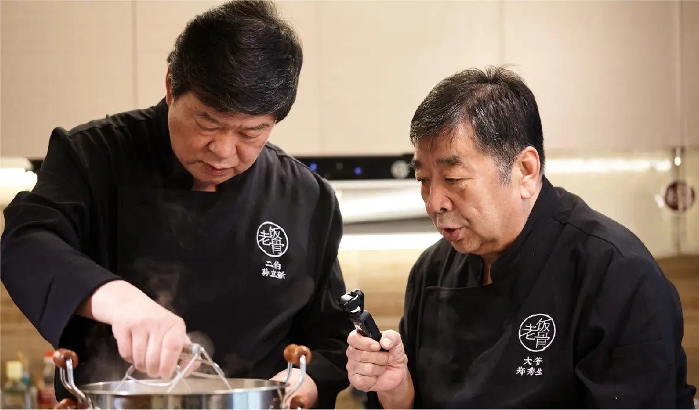

做饭，跟踢毽子一样，也是一个非常好的学习方法试验田。

做饭有点像是流水线，它是严格的步骤化的，过程透明，变量可控，结果清楚。也就是说只要做出来的饭不好吃，一定是你自己做饭时中间的某个过程出了差错，怨不了天，怨不了地。

<!--more-->

曾经有一段时间，我痴迷做饭到了废寝忘食的地步。大晚上的也不睡觉，脑海里就一直盘旋着拍黄瓜、麻婆豆腐、回锅肉、炒土豆丝、豆腐汤这些菜品的做法：

1. 怎么食材处理
2. 怎么调味
3. 怎么烹饪

躺在床上想那些流程，来来回回的在大脑里做预演，然后不知不觉，就凌晨两三点钟了。

## 谈谈学习的本质

有个问题我思考了四五年了，我一直在问自己，学习这件事，有没有通用的方法论？

通过「学做饭」这件事儿，我觉得完全可以借此深挖一下学习的本质。

### 第一个结论

你仔细想想你是怎么定义「学习」的呢？长期以来，我们脑海中的「学习」，都是坐在教室里苦哈哈的念课本，背不过《赤壁赋》就罚站去了，对不对？「学习」这个词，实在是被糟蹋坏了。什么是「真正的学习」呢？

### 第二个结论

学习就是训练大脑、为大脑做保健操的过程。

计算机编程，物理、数学、钢琴、网球、烹饪，从宏观看，这些都是人类智慧的结晶；从微观看，它们是一个一个的学科，一个一个的专业，每个学科的教材摞起来都至少一人多高。

我们其实都不自觉的陷入微观而缺少宏观的视野，当然，「分科制」更加剧了这种问题。

我们习惯把学科划分为文科、理科，我们下意识的把各个学科独立开。这种观念塑造了太多对未知没有好奇心的人，我们身边有太多「理直气壮的不懂」、「理直气壮拒绝与自己专业无关的学习」的人，我们都是在这样的观念下长大成人的。

这样的观念是思想上的监狱，会让一个人一辈子固守在一个圈儿里面，很舒服，也很单薄。

任何学科、任何知识，都是人类大脑“运动”的结果。学习这些学科，学习这些知识，就是沿着前辈们实验成功的路子再动用你的大脑重新运动一次，是大脑的体操。

老话说得好：多动动脑筋不生锈。

### 第三个结论

做饭是不是这么一回事呢？正确的食材处理，用正确的火候对食材予以烹饪和调味。

踢毽子是不是这么一回事呢？准确预判毽子的起落时间，用正确的姿势，把毽子好好的踢出去 。

软件编程是不是这么一回事呢？在程序运行时，用准确的程序逻辑处理数据。

弹钢琴是不是这么一回事呢？正确的时间节奏，正确的弹奏方式，正确的击中某个黑白键。

磨菜刀或者火箭升天，都是这么一回事儿。

这里的正确指的是什么呢？正确代表的就是「专业」。

我们学的是什么？学的就是专业的手法。各个领域有各种知识点，所谓刻意练习，就是把那些知识点加载到你的大脑，融会贯通，达到专业。

学科应该「大同」，学科本来就「大同」。
