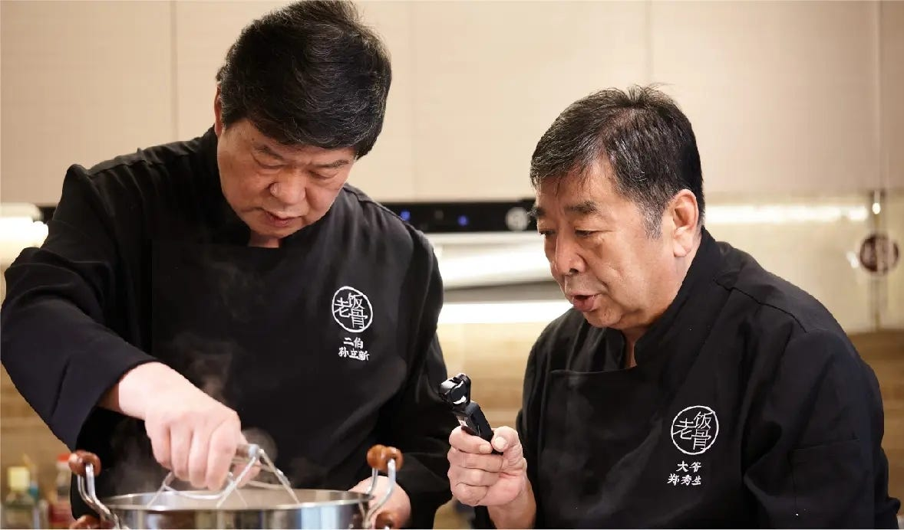

做饭，跟踢毽子一样，也是一个非常好的学习方法试验田。

做饭有点像是流水线，它是严格的步骤化的，过程透明，变量可控，结果清楚。也就是说只要做出来的饭不好吃，一定是你自己做饭时中间的某个过程出了差错，怨不了天，怨不了地。

<!--more-->

曾经有一段时间，我痴迷做饭到了废寝忘食的地步。大晚上的也不睡觉，脑海里就一直盘旋着拍黄瓜、麻婆豆腐、回锅肉、炒土豆丝、豆腐汤这些菜品的做法：

1. 怎么食材处理
2. 怎么调味
3. 怎么烹饪

躺在床上想那些流程，来来回回的在大脑里做预演，然后不知不觉，就凌晨两三点钟了。

有个问题我思考了四五年了，我一直在问自己，学习这件事，有没有通用的方法论？

通过「学做饭」这件事儿，我觉得完全可以借此深挖一下学习的本质。

你仔细想想你是怎么定义「学习」的呢？长期以来，我们脑海中的「学习」，都是坐在教室里苦哈哈的念课本，背不过《赤壁赋》就罚站去了，对不对？「学习」这个词，实在是被糟蹋坏了。什么是「真正的学习」呢？

### 第一个结论

> 什么是学习？学习是训练大脑、为大脑做保健操的过程。

计算机编程，物理、数学、钢琴、网球、烹饪，从宏观看，这些都是人类智慧的结晶；从微观看，它们是一个一个的学科，一个一个的专业，每个学科的教材摞起来都至少一人多高。

我们其实都不自觉的陷入微观而缺少宏观的视野，当然，「分科制」更加剧了这种问题。

我们习惯把学科划分为文科、理科，我们下意识的把各个学科独立开。这种观念塑造了太多对未知没有好奇心的人，我们身边有太多「理直气壮的不懂」、「理直气壮拒绝与自己专业无关的学习」的人，我们都是在这样的观念下长大成人的。

这样的观念是思想上的监狱，会让一个人一辈子固守在一个圈儿里面，很舒服，也很单薄。

任何学科、任何知识，都只是一项运动(Sport)而已，就跟做俯卧撑一样。学习这些学科，学习这些知识，只不过就是沿着前辈们实验成功的路子再动用你的大脑重新运动一次，是实打实的大脑的体操。

老话说得好：多动动脑筋不生锈。

### 第二个结论

> 学习学什么？学习学的是在正确的时间用正确的方式做正确的事。

这句话想必我们都再熟不过了吧，但是，要么就轻飘飘的一嘴带过，要么就用错了地方，而忽视了这句话真正的分量。

做饭是不是这么一回事呢？正确的食材处理，用正确的火候对食材予以烹饪和调味。

踢毽子是不是这么一回事呢？准确预判毽子的起落时间，用正确的姿势，把毽子结结实实的踢出去。

软件编程是不是这么一回事呢？在程序运行时，用准确的程序逻辑处理数据。

弹钢琴是不是这么一回事呢？正确的时间节奏，正确的弹奏方式，正确的击中某个黑白键。

磨菜刀或者火箭升天，都是这么一回事儿。

这里的`正确`指的是什么呢？正确代表的就是`专业`。

> 我们学的是什么？学的就是那专业的手法。
>
> 各个领域有各种知识点，所谓刻意练习，就是把那些知识点加载到你的大脑，融会贯通，达到专业。

学科应该「大同」，学科本来就「大同」。
