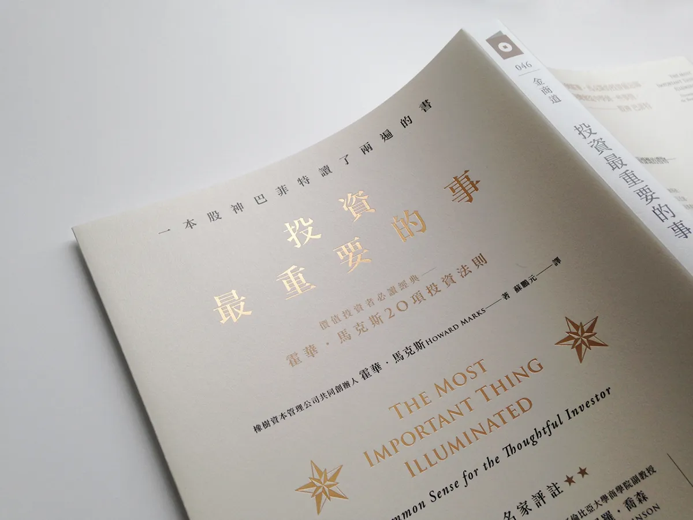

投资有点像是押宝，而押宝本质上是一个概率游戏，我们冒着风险赌上帝站在我们这边。

风险，是发生意外的可能性。风险小，发生意外的可能性小；风险大，发生意外的可能性就大。我们是奔着拿收益去的，如果把投资比做一场漫长的战争，那么战胜是我们力求争取的，战败则是我们力求规避的。如果一场战争到处是雷、到处是坑，己方一头雾水，对战局一无所知，此时我们大概率不会贸然参战，但是在投资活动中，特别是在狂热时期，不顾风险玩儿烫手游戏、听凭运气发落的投资者，并不算少见。

<!--more-->

理解你的投资标的，理解标的背后的风险，长期观察风险因子，这种投资风格保守、谨慎、小心翼翼，甚至会让人觉得无聊透顶，但可能正是投资的大道，是投资中最重要的事。《孙子兵法》中有着类似极为精妙的表述：

> 昔之善战者，先为不可胜，以待敌之可胜。不可胜在己，可胜在敌。故善战者，能为不可胜，不能使敌之必可胜。故曰：胜可知，而不可为。

投资的过程好像史诗，时而辉煌壮丽，时而又跌进低谷，跌入至暗时刻，如此反复，充满戏剧性。

投资又好像是舵手驾驶着船只在大海上航行，起起伏伏，没有任何一波海浪受你个人意志的影响。

Howard Marks 在开篇中说道：

> 这本书是对我的投资理念的陈述。我视其为信条，它在我的投资生涯中扮演着类似宗教信仰的角色。我信奉这些事情，它们是指引我保持正确轨道的路标。

带着信仰去做事，事情就会被限定在某种框架之内；缺少了信仰，就缺少了边界，处理事情的手段就可以无所不用其极，最终自噬。
