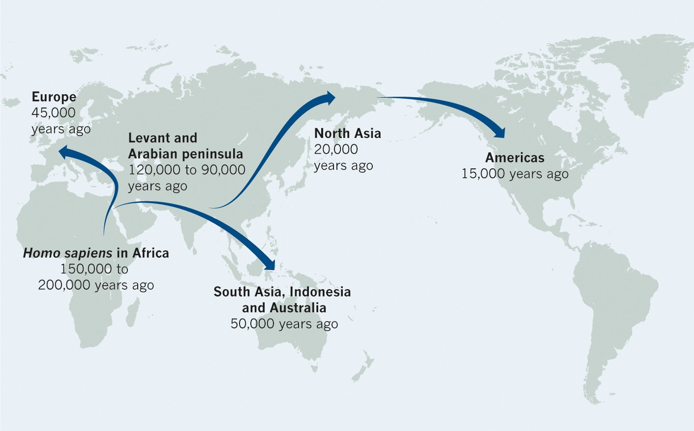

人类文明中，熠熠闪光的是人的智慧，无数能工巧匠前仆后继地为人类文明添砖加瓦，遂有了当今盛世。

大家都看到了这条明线，所以才会挤破了脑袋追名逐利，凡阻碍了自己名或利者，虽远必诛。

但太多的人犯了一个错误，太看重我而轻视了TA，太在意个体而忽视了群体，大多数人都没有看到或者是没有太在意这个无比宏大叙事里的暗线：接力。

<!--more-->

人类之所以能走到今天，就是因为人类选择了一场以接力形式往前推进的无限游戏，十五万年时间，便主宰了地球。



## 自己在接力赛的位置

一个人最好能看清自己在人类文明中的位置， 而人生只不过是人类文明中一个很小的区间。当一个人把人类文明看清楚了，那么对于人生来说，大体上就类似于一道清楚明白的逻辑题目了。

```javascript

if (选择参赛) {
    do(心里建设：赛手的唯一职责是为后人留下参考和借鉴，而不是自己达成既定目标。达成既定目标固然可喜，没有达成目标也为后人留下思路和借鉴，后人方可以在前人得与失的基础上重新出发。由此可知，顺利交付接力棒的是英雄，之前无数次冲锋的扫雷英雄也是英雄)
    do(心里建设：扫雷工作总要有人做)
    do(心里建设：认认真真求索前辈们留下的蛛丝马迹，虚心求教，求真务实，实事求是，大彻大悟，继往开来)

    for true {
        do(找个赛道)
        do(打底子阶段：学习智慧)
        do(打基础阶段：学习知识)
        do(实战阶段：用智慧解决问题)
        do(绝望阶段：复盘以校验智慧)
        do(成熟阶段：用高等智慧解决问题)
    }
} else {
    do(养家糊口)
    do(享受生活)
}

```

## 自己在接力赛的位置之坑

一个人，无论选择参赛还是选择不参赛，都必须接受「自己很有可能平庸」的事实。

如果你不接受：

1. 假如你选择参赛，你的肉体会伤痕累累，你的精神会备受折磨。比聪明人还聪明的人历史上多了去了，比你能干能打的人注定无数。
2. 即便赋闲回家享受生活，你依然会不甘心、不满意、不幸福。

为什么「众生皆苦」？因为既要又要还要，要的太多了，但自己得到的总觉得太少了，苦，便来了。

你不能既选择了艰苦又贪图享乐，造物主没有给任何人这个选项。

你不能妄图自己一登场就是天选之子，一路顺风顺水，直捣黄龙。

你不能指望别人都是绿叶，自己只能当鲜花。

你不能无视前人做出的努力，自己是独创独家独孤求败。

你不能迷迷糊糊，把假的当成真的，把错的当作对的，指鹿为马。

人只有一件事儿是肯定的：从错误中来，到相对正确中去，如此反复，可得智慧。

这就是为什么司马光用案例教学法写《资治通鉴》的原因。

## 人生幸福的核心是低姿态

一个人在人类文明中，非常渺小，非常短暂。个人只是人类文明中的一小部分，而人类文明，是由无数历史上的人共同缔造出来的，而不是某一个人、某几个人的结果。

因此，个人注定是单薄的、有限的，能量是有限的，能起到的作用是有限的，甚至是不可避免的渺小的、微不足道的。

承认自己渺小的人，才能「一箪食，一瓢饮，在陋巷，人不堪其忧，回也不改其乐」。

承认自己渺小的人，才能在巨大成功光环下还能是谦谦君子，还能像宫崎骏那样老当益壮。

人生，像是爬坡，应该是从低处往高处去爬。

从高处往地处爬，风景越来越差，自己越来越无法接受，最终精神状态成大问题。

从低处往高处爬，低处是愚昧之谷，高处是智慧之巅。先确定低姿态，确定自己在人类历史长河中其实根本算不上数。从确定自己真的吃不了几碗干饭开始爬坡，存鹰之心于高远，融鹰之神在山巅，于是你就要去积累，需要求教百家之所长，需要事儿上练，需要反思和复盘。看！你一直在往上走，风景越来越好，收获的都是积极的、正向的回报。

姿态低低的吧，别动不动就想超越这个、赢过那个，把自己的事儿想明白，就可以了，就已经很了不起了，想想这个世界上有多少高人啊。姿态低一些，谦虚一些，永永远远以发自肺腑的向人求教的态度待人处事，是人生的最佳姿态。
