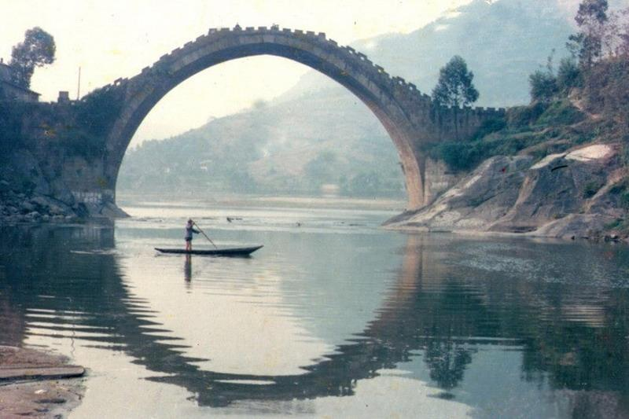

设想一个场景：你眼前有一座高拱石桥，桥长45米，高27米，面宽10.3米，均用青石砌成半圆形拱，从桥头上拱顶，两端共有石梯76级，坡度六十五度。

设想以下几个问题：旅途中，人挤人，别人在桥上看风景，你在桥下看人，是什么滋味？你想不想站上去看一看？你能不能站上去看一看？

<!--more-->

这个场景是我对「落伍」二字具象化的一种描述。

我们看父母，看亲戚，看朋友，仔细观察就会发现一些区别，并不是穷与富的区别，而是新与旧的区别，这种区别逐渐蔓延到我们三十岁上下的这一波年轻人。

有些人的头脑是崭新的，面对新事物是有兴趣的，是会被点燃起好奇心的。而有些人的头脑是陈旧的，遇到新生事物便如临大敌，恐惧感与无力感同时来袭，就像是来了一张考察我们记忆力、学习力的考卷一样。

我多想一辈子都在桥头上站着，一辈子都站在时代的前沿，一辈子都在浪潮之巅。

我不是没站到过桥头，我也曾触碰过浪潮之巅，可是，拔剑四顾，我发现自己已经从桥头上下来了。而桥头之上，不仅有年轻人在上面，有很年轻很年轻的年轻人在上面，也有头发花白的老者（真让人敬佩）。我看到他们眯缝着眼睛在眺望远方。我为什么能看到？因为我刚下来，我就在桥头扶梯的正下面。可我什么都看不到，我只能是抬着头看着他们手指的方向，听着他们的号令“齐步...走”。

好想站在桥头，好想触碰浪潮之巅。