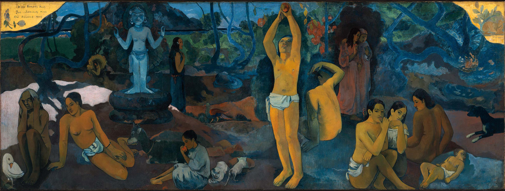

苏轼说“寄蜉蝣于天地，渺沧海之一粟”，又说“哀吾生之须臾，羡长江之无穷”，恨不得“挟飞仙以遨游，抱明月而长终”。苏子啊苏子，您要求也太高了。

<!--more-->

法国印象派画家高更在 1897 年用画作的方式向人类提出经典三问：

1. 我们从何处来？
2. 我们是谁？
3. 我们向何处去？

100 多年后，一个叫李录的华人用 166 页的文字，站在 15 万年人类发展史的高度，对高更三问给出了相对科学的、系统的解释，这本书叫做《文明、现代化、价值投资与中国》。

## 英雄创造历史还是人民群众创造历史

我们一直说「人民群众创造历史」，我们课本中是这么写的，口号是这么喊的，官媒是如此宣扬的，人民群众的历史地位似乎就是那么上下一心的确凿和不可撼动。

但我相信没有多少人真的相信这句话，没有什么比当下的钞票更夺目，没有什么比手中的权利更有诱惑，全社会的人，上下一心的争先恐后，上下一心的争着出人头地，上下一心的争当英雄。

不只是中国人，而是全地球的人，哪怕是原始部落，酋长都是令人艳羡的位子，所以啊，人类骨子里是相信英雄创造历史的，因为我们看到、听到并且认识到：

1. 镌刻在历史上、被世人敬仰的都是英雄，英雄，是有名字的；
2. 英雄，会得到鲜花和掌声，会名利双收，还有机会名垂千古；

很少有人看到一将功成万骨枯，大多数人都在平庸的道路上忙着把烫手的山芋甩给别人，忙着把亮眼的成绩归为自己的努力。

人民群众创造历史是个难得的、稀缺的、伟大的洞见！

毛泽东就是利用的这个洞见打败了有美国做后盾的蒋介石，一码归一码，毛确实是个伟大的军事家和政治家。

高阶维度的洞见，不太容易被寻常人理解，最终成为口号，也是无可奈何的事。

放弃简单的、符合人性的、看起来不错的“常识”（寻常见识），转过头去相信困难的、反人性的洞见，非常难，需要好奇，需要视野，需要知识，需要理性，需要探索。

## 真正的主人翁意识

在漫长的历史长河中，英雄的数量一定远远小于人民群众的数量，因此，以英雄为追逐目标，失败率其实是相当之高的。

失败率高等于风险大，风险大约等于做无用功。我不喜欢空转，不喜欢做失败率高的事情。

如果你也跟我一样不喜欢失败率高的事情，那么：

1. 也许你也需要放弃对英雄的追逐，放弃随大流，放弃争先恐后，甚至放弃短期的争名逐利；
2. 也许你需要明白英雄本是平凡，你也平凡，你身边的人、远方的人、过去的人、未来的人，都本是平凡，人类的发展就是靠着这平凡的人一寸一寸的进展，量的积累，最终实现了质的进步。

英雄有多神秘，对英雄祛魅，就有多难。

只有对英雄祛了魅，才能平视英雄，才能解构英雄，才能解构伟大，才能解构人类文明，才能把人类的文明当成自己的文明，才能把人类的知识吸收为自己的知识，才能谦逊，才能虚怀若谷，才能“胸中有丘壑，立马振山河”，才能心无杂念的继往开来。

这就是主人翁意识。
